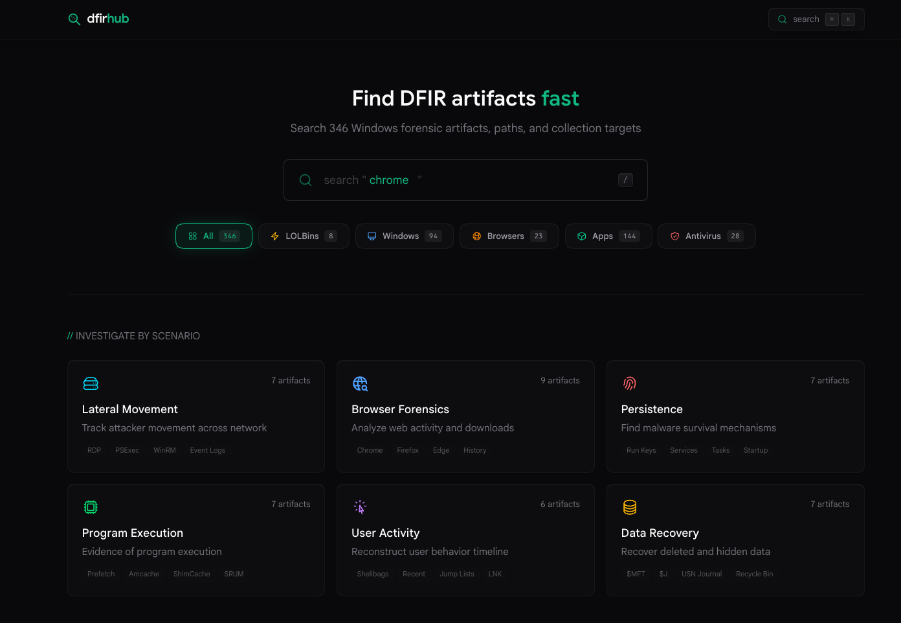

# DFIRHub

A web application for searching Windows forensic artifacts, converting Sigma rules, and generating collection scripts.



## Features

- **Artifact Search** — Browse and search Windows forensic artifacts with KAPE integration
- **Sigma Converter** — Convert Sigma rules to 17+ backends (Splunk, Elastic, KQL, Loki, CrowdStrike, etc.) using pySigma in-browser via Pyodide
- **SigmaHQ Search** — Search and import rules directly from the SigmaHQ repository
- **Collection Commands** — Generate PowerShell, Batch, and WSL collection scripts
- **Script Builder** — Build custom multi-artifact collection scripts
- **Keyboard Navigation** — Full shortcut support (`/`, `Cmd+K`, `Cmd+Shift+K`, vim-style `g` sequences)

## Quick Start

```bash
git clone https://github.com/LasCC/DFIRHub.git
cd DFIRHub
git submodule update --init --recursive
bun install
bun dev
```

Open `http://localhost:4321`.

## Commands

| Command               | Description                            |
| --------------------- | -------------------------------------- |
| `bun dev`             | Development server                     |
| `bun build`           | Production build                       |
| `bun preview`         | Preview production build               |
| `bun run test`        | Run tests                              |
| `bun run sigma:index` | Rebuild Sigma rules index from SigmaHQ |

## Project Structure

```
src/
├── components/
│   ├── converter/    # Sigma rule converter UI
│   ├── layout/       # Header, Footer
│   ├── search/       # Pagefind search
│   └── ui/           # Shared Radix UI primitives
├── content/kapefiles # KapeFiles git submodule
├── lib/sigma/        # Sigma converter engine (Pyodide worker, backends, pipelines)
├── pages/            # Astro file-based routing
└── styles/           # Global Tailwind styles
```

## CI/CD Pipelines

Both workflows require a `NETLIFY_BUILD_HOOK` secret (Netlify → Build hooks → copy URL → GitHub → Repo secrets).

| Workflow                 | Schedule                 | What it does                                                                           |
| ------------------------ | ------------------------ | -------------------------------------------------------------------------------------- |
| `update-kapefiles.yml`   | Weekly (Mon 00:00 UTC)   | Triggers Netlify rebuild to pull latest KapeFiles submodule                            |
| `update-sigma-rules.yml` | Monthly (1st, 02:00 UTC) | Rebuilds Sigma rules index from SigmaHQ API, commits changes, triggers Netlify rebuild |

Both support `workflow_dispatch` for manual triggering.

## Keyboard Shortcuts

| Shortcut       | Action                             |
| -------------- | ---------------------------------- |
| `/` or `Cmd+K` | Open search                        |
| `Cmd+Shift+K`  | Open Sigma search (converter page) |
| `g h`          | Go to home                         |
| `g a`          | Go to artefacts                    |
| `g c`          | Go to collections                  |
| `g b`          | Go to builder                      |
| `?`            | Show all shortcuts                 |

## Tech Stack

[Astro](https://astro.build) + React, [Tailwind CSS](https://tailwindcss.com), [Pagefind](https://pagefind.app), [Pyodide](https://pyodide.org), [Netlify](https://netlify.com)

## License

[MIT](LICENSE)

## Acknowledgments

- [Eric Zimmerman](https://github.com/EricZimmerman) — KapeFiles and KAPE
- [SigmaHQ](https://github.com/SigmaHQ/sigma) — Sigma detection rules
- [pySigma](https://github.com/SigmaHQ/pySigma) — Sigma conversion engine
